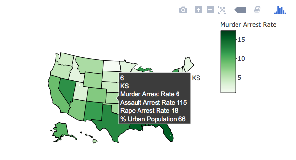

<style>
.title-slide {
  background-color: #FFFFFF; /* #EDE0CF; ; #CA9F9D*/
}
</style>

```{r, echo=FALSE,warning=FALSE, message=FALSE}
require(ggplot2)
require(plotly)
```

## Overview
This application provides a breakdown of the *USArrests* dataset in R. The data set contains statistics, in arrests per 100,000 residents for assault, murder, and rape in each of the 50 US states in 1973. Also given is the percent of the population living in urban areas.

The application provides the user the ability to view the data in several different ways:
> 1. Overall statistics
> 2. Arrest statistics broken down by US states
> 3. Graphical map of the arrest statistics
> 4. Simple prediction of murder arrest rate based on the other variables

---

## Overall Statistics
The application provides a simple way for a user to view the overall statistics of the dataset.
```{r, echo=FALSE}
str(USArrests)
summary(USArrests)
```

---

## Arrests Statistics by State
The user can view the the states with the highest arrests rates or filter based on selected criteria. For example:

```{r, echo=FALSE,fig.height=5,fig.width=7}
StateAbr = c('AL','AK','AZ','AR','CA','CO','CT','DE','FL','GA','HI','ID','IL','IN','IA',
               'KS','KY','LA','ME','MD','MA','MI','MN','MS','MO','MT','NE','NV','NH','NJ',
               'NM','NY','NC','ND','OH','OK','OR','PA','RI','SC','SD','TN','TX','UT','VT',
               'VA','WA','WV','WI','WY')
  USArrestsUpdated <- data.frame(USArrests,State = StateAbr)
 ggplot(USArrestsUpdated[1:5,],aes(x=reorder(State, -Assault),y=Assault, fill=State))+geom_bar(stat="identity") + 
      theme(legend.position = "none", axis.text=element_text(size = 6, angle = 90)) + scale_x_discrete(name="State") + scale_y_continuous(name="Assault Arrests (per 100K)")

```

---

## Graphical Map 
The user can see a visual display of the arrest statistics on a graphical map. For example:
 

---

## Prediction Modelling
The user can check prediction models for murder arrest rates based on the other variables. For example:

```{r, echo=FALSE,fig.height=5,fig.width=7}
model <- lm(USArrestsUpdated$Murder ~USArrestsUpdated$Assault)
plot(USArrestsUpdated$Assault,USArrestsUpdated$Murder, xlab ="Assault Arrest Rate", ylab = "Murder Arrest Rate", bty="n", pch=16, cex=1.5)
      abline(model,col="blue",lwd=2)
```

---

## Thank You
This simple design any layout of the application allows the user to look at the data from many different perspectives. 

I hope you enjoy using the application!

Thank You!
